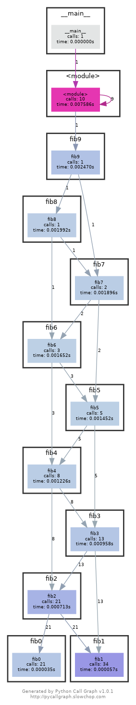
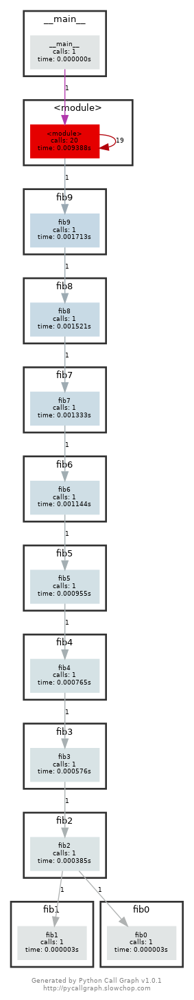

# Solutions of Lecture 7

## Debugging

1. Use `journalctl` on Linux or `log show` on macOS to get the super user accesses and commands in the last day. If there aren’t any you can execute some harmless commands such as `sudo ls` and check again.

```
journalctl --since "1 day ago" | grep sudo | grep -o 'COMMAND=.*' | sed 's/COMMAND=//'
```

3. Install shellcheck and try checking the following script. What is wrong with the code? Fix it. Install a linter plugin in your editor so you can get your warnings automatically.

```
#!/bin/sh
## Example: a typical script with several problems
for f in $(ls *.m3u)
do
  grep -qi hq.*mp3 $f \
    && echo -e 'Playlist $f contains a HQ file in mp3 format'
done
```

Fixed with `shellcheck`:

```
#!/bin/sh
## Example: a typical script with several problems
for f in .*mp3
do
  grep -qi "hq.*mp3" "$f" \
    && echo "Playlist $f contains a HQ file in mp3 format"
done
```

## Profiling

1. Here are some sorting algorithm implementations. Use `cProfile` and `line_profiler` to compare the runtime of insertion sort and quicksort.

What is the bottleneck of each algorithm? For `insertionsort` the `while` loop (lines 16-18), for `quicksort` the assignation of `left` and `right` `list`s and the recursive calls in the `return` (lines 31-33).

```
Total time: 0.147234 s
File: sorts.py
Function: insertionsort at line 10
Line #      Hits         Time  Per Hit   % Time  Line Contents
==============================================================
    10                                           @profile
    11                                           def insertionsort(array):
    12
    13     25040       4557.8      0.2      3.1      for i in range(len(array)):
    14     25040       4514.2      0.2      3.1          j = i-1
    15     25040       4795.7      0.2      3.3          v = array[i]
    16    200887      48542.8      0.2     33.0          while j >= 0 and v < array[j]:
    17    200887      43160.4      0.2     29.3              array[j+1] = array[j]
    18    200887      35753.5      0.2     24.3              j -= 1
    19     25040       5701.2      0.2      3.9          array[j+1] = v
    20      1000        208.2      0.2      0.1      return array

Total time: 0.0614655 s
File: sorts.py
Function: quicksort at line 23

Line #      Hits         Time  Per Hit   % Time  Line Contents
==============================================================
    23                                           @profile
    24                                           def quicksort(array):
    25     17063       3763.8      0.2      6.1      if len(array) <= 1:
    26     17063       2546.3      0.1      4.1          return array
    27     16063       2930.1      0.2      4.8      pivot = array[0]
    28     16063      19682.8      1.2     32.0      left = [i for i in array[1:] if i < pivot]
    29     16063      18916.8      1.2     30.8      right = [i for i in array[1:] if i >= pivot]
    30     16063      13625.7      0.8     22.2      return quicksort(left) + [pivot] + quicksort(right)
```

Use then `memory_profiler` to check the memory consumption, why is insertion sort better? Check now the inplace version of quicksort. Inplace does not increase memory noticeably in any step because the majority of operation are done in place.

```
Challenge: Use `perf` to look at the cycle counts and cache hits and misses of each algorithm.
Filename: quicksorts.py

Line #    Mem usage    Increment  Occurrences   Line Contents
=============================================================
     4   21.383 MiB   21.102 MiB        1803   @profile
     5                                         def quicksort(array):
     6   21.383 MiB    0.000 MiB        1803       if len(array) <= 1:
     7   21.383 MiB    0.000 MiB         902           return array
     8   21.383 MiB    0.000 MiB         901       pivot = array[0]
     9   21.383 MiB    0.000 MiB       15173       left = [i for i in array[1:] if i < pivot]
    10   21.383 MiB    0.000 MiB       15173       right = [i for i in array[1:] if i >= pivot]
    11   21.383 MiB    0.281 MiB         901       return quicksort(left) + [pivot] + quicksort(right)


Filename: quicksorts.py

Line #    Mem usage    Increment  Occurrences   Line Contents
=============================================================
    14   21.383 MiB   21.383 MiB        1803   @profile
    15                                         def quicksort_inplace(array, low=0, high=None):
    16   21.383 MiB    0.000 MiB        1803       if len(array) <= 1:
    17                                                 return array
    18   21.383 MiB    0.000 MiB        1803       if high is None:
    19   21.383 MiB    0.000 MiB           1           high = len(array)-1
    20   21.383 MiB    0.000 MiB        1803       if low >= high:
    21   21.383 MiB    0.000 MiB         902           return array
    22                                         
    23   21.383 MiB    0.000 MiB         901       pivot = array[high]
    24   21.383 MiB    0.000 MiB         901       j = low-1
    25   21.383 MiB    0.000 MiB       13716       for i in range(low, high):
    26   21.383 MiB    0.000 MiB       12815           if array[i] <= pivot:
    27   21.383 MiB    0.000 MiB        9819               j += 1
    28   21.383 MiB    0.000 MiB        9819               array[i], array[j] = array[j], array[i]
    29   21.383 MiB    0.000 MiB         901       array[high], array[j+1] = array[j+1], array[high]
    30   21.383 MiB    0.000 MiB         901       quicksort_inplace(array, low, j)
    31   21.383 MiB    0.000 MiB         901       quicksort_inplace(array, j+2, high)
    32   21.383 MiB    0.000 MiB         901       return array
```

Challenge: Use perf to look at the cycle counts and cache hits and misses of each algorithm.

```
# TODO
```

6. Here’s some (arguably convoluted) Python code for computing Fibonacci numbers using a function for each number.

```
#!/usr/bin/env python
def fib0(): return 0

def fib1(): return 1

s = """def fib{}(): return fib{}() + fib{}()"""

if __name__ == '__main__':

    for n in range(2, 10):
        exec(s.format(n, n-1, n-2))
    # from functools import lru_cache
    # for n in range(10):
    #     exec("fib{} = lru_cache(1)(fib{})".format(n, n))
    print(eval("fib9()"))
```

Put the code into a file and make it executable. Install prerequisites: `pycallgraph` and `graphviz`. (If you can run `dot`, you already have GraphViz.) Run the code as is with `pycallgraph graphviz -- ./fib.py` and check the `pycallgraph.png` file.

How many times is `fib0` called? 21 times.



We can do better than that by memoizing the functions. Uncomment the commented lines and regenerate the images. How many times are we calling each `fibN` function now? 1 time.




7. A common issue is that a port you want to listen on is already taken by another process. Let’s learn how to discover that process pid. First execute `python -m http.server 4444` to start a minimal web server listening on port `4444`. On a separate terminal run `lsof | grep LISTEN` to print all listening processes and ports. Find that process pid and terminate it by running `kill <PID>`.

```
lsof | grep 'python .*LISTEN)' | awk '{ print $2 }' | kill
```

